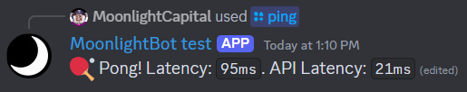
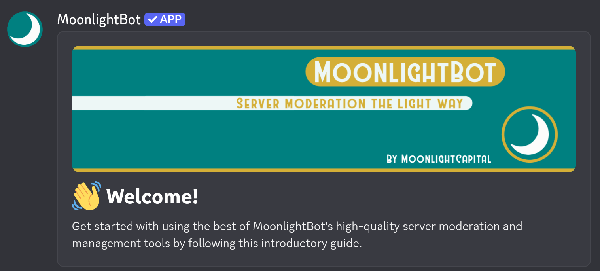
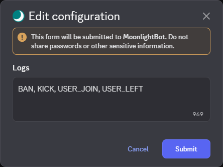
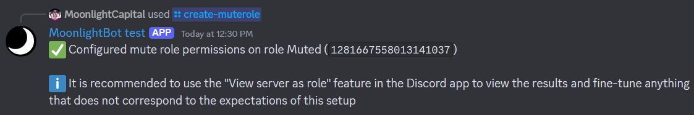
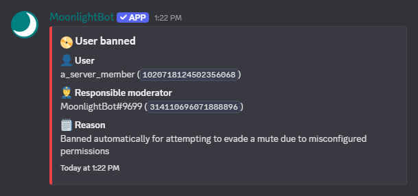

# MoonlightBot Documentation

Welcome to the documentation for MoonlightBot! MoonlightBot is a powerful moderation bot for Discord with a focus on user-friendliness and efficiency. It's simple to use and easy to set up, and is run and maintained entirely by volunteers. This documentation will teach you everything you need to know to use MoonlightBot to its fullest potential.

## Getting Started

First, add MoonlightBot to your server using [this invite link](https://discord.com/api/oauth2/authorize?client_id=314110696071888896\&permissions=1512298638534\&scope=applications.commands%20bot). It is recommended (but not required) that you grant all requested permissions to ensure all features work correctly.


You can only add bots to servers in which you have the Manage Server permission.


Once you've added MoonlightBot to your server, you can verify that it's working by using the [`/ping`](miscellaneous-commands/other-minor-commands.md#ping) command.

<figure><figcaption><p>The output of the of the <code>/ping</code> command</p></figcaption></figure>

Join our support server, this is optional but highly recommended: [**https://discord.gg/hNQWVVC**](https://discord.gg/hNQWVVC)

If this is your first time using MoonlightBot, you'll receive a Direct Message welcoming you to the bot and providing several recommendations, including reading the [Acceptable Use Policy](policies/acceptable-use-policy.md). Please read this carefully, as a violation of the Acceptable Use Policy can result in you being banned from using the service.

<figure><figcaption><p>The beginning of the introductory guide DM. The rest of the message continues explaining the introductory activities.</p></figcaption></figure>

We also suggest that you review the [Moderation Tutorial](start-up/moderation-tutorial.md) and share it with your server moderators and administrators once you've finished the configuration.

## Changing MoonlightBot's Language

MoonlightBot supports multiple languages for its commands and responses, and can be set server-wide or per-user. Set your server's language using

```
/config settings locale:LANG
```

For your personal user language use

```
/userconfig settings locale:LANG
```

`LANG` is the language you want MoonlightBot to respond in.

A list of supported languages is available on the [Discord's official list](https://discord.com/developers/docs/reference#locales); Locale, Language Name, and Native Name are all valid inputs. Alternatively, `auto` can be used for MoonlightBot to detect your preferred language from your Discord settings.


MoonlightBot is translated entirely by volunteers, so not all languages are complete or not yet translated at all. Incomplete and missing translations will be show in English. If you would like to help us with your native language, please consider [translating it for us!](support/volunteering.md#translator)


## Role Management, Temporary Roles

MoonlightBot provides easy and dynamic role management by staff and members alike, including [Reaction Roles](start-up/setting-up-reaction-roles.md). It can precisely execute actions after a specified amount of time.

* A role can be temporarily added with [`/temprole`](role-management-commands/temprole.md), when [someone joins the server](management-commands/config.md#roles-join-assignable), or [in many other ways](start-up/faqs.md#how-does-the-temporary-role-feature-work)
* A role can be temporarily removed with [`/pause-role`](role-management-commands/pause-role.md)
* All active temporary roles can be listed with [`/list-temproles`](role-management-commands/list-temproles.md)
* Roles added to members can be automatically detected to be made temporary using the [`detect-assignment` config option](management-commands/config.md#roles-detect-assignment)

You can also permanently assign or remove any role to a user with [`/role`](role-management-commands/role.md), or setup [Reaction Roles](start-up/setting-up-reaction-roles.md) and let members give themselves configured roles with [`/selfrole`](role-management-commands/selfrole.md)

## Command Permissions

MoonlightBot uses [Discord's built-in permissions system](https://support.discord.com/hc/en-us/articles/10952702911639-Command-Permissions-Lockout) to control who is and is not able to execute certain commands. Some commands have required permissions set by default, and overrides for specific members and roles can be applied to any and all commands.

To set up permissions properly, please follow the [Permission Tutorial](start-up/permission-tutorial.md).

## Logging

MoonlightBot offers highly granular logging, and can log all kinds of actions to one or more channels. To enable and configure logging for a specific channel, use the command

```
/config channels channel:LOG-CHANNEL logs:Open editor
```

where `LOG-CHANNEL` is the channel you want logs posted to.

An editor will open where you can enter items or categories from the [list of log names](advanced/list-of-log-names.md), or an asterisk (`*`) to log everything. The list of items and categories to log should be separated by commas and spaces, like so: `BAN, KICK, Members`

<figure><figcaption><p>The modal to edit logs. This will soon be replaced with an innovative system</p></figcaption></figure>

## The Mute Command and Mute Role

MoonlightBot can mute members both temporarily and permanently. Use the command

```
/create-muterole [role]
```

to set up a permission-restricted mute role. Specifying the `role` [option](start-up/options.md) allows you to set up an existing role, or you can leave it out to create a new `@Muted` role.

<figure><figcaption><p>Result of the <code>/create-muterole</code> command</p></figcaption></figure>

You will now be able to use [`/mute`](moderation-commands/mute.md), [`/tempmute`](moderation-commands/tempmute.md), and [`/unmute`](moderation-commands/unmute.md).

## Mute Evasion Bans

Evasions bans are a fallback moderation feature to ensure muted members cannot abuse improperly configured permissions by escalating a mute punishment to a harsher ban.

If a user with your server's mute role sends a message in a channel, they will be banned. To enable evasion bans, use the command

```
/config settings mute-evasion-ban:True
```

All channels will now be monitored for new messages sent by muted members. To create exceptions to the evasion ban and allow muted members to talk in specific channels, use

```
/config channels channel:IGNORED-CHANNEL ignore-mute-evasion-ban:True
```

where `IGNORED-CHANNEL` is the channel you want ignored. Ignoring a channel will also ignore threads under the channel.

When an evasion ban is triggered, a `BAN` event [can be logged](./#logging).

<figure>><figcaption><p>A mute evasion ban being logged looks like this</p></figcaption></figure>


Evasion Bans can be set up with [MoonlightBot Premium](support/premium.md). If you think this feature can help you, [vote for MoonlightBot](support/upvote-moonlightbot.md) to earn an infinitely extendable subscriptions or [support us in other ways](support/premium.md).


## Support the Development of MoonlightBot

MoonlightBot is run and maintained by volunteers, and is funded entirely by [Premium Subscriptions](support/premium.md). These subscriptions help us fund hosting and give you great benefits, making them a fantastic way to support us.

You can also help by [upvoting the bot](support/upvote-moonlightbot.md) or by [joining our team of testers, translators, and documentation writers](support/volunteering.md). Yes, the contents of this documentation are work of volunteers, too!

Our strong point is **listening to our users' suggestions**. If you have an idea for something that can help your server's moderation, we will gladly listen and consider. Users can vote on suggestions to decide what to prioritize. All of this is done in MoonlightBot's support server.

## Questions? Problems?

Please read the [Frequently Asked Questions](start-up/faqs.md) first to see if your question or problem is answered there. If your question or problem is still unanswered, [join the support server](https://discord.gg/hNQWVVC) and we will help you as best we can!
