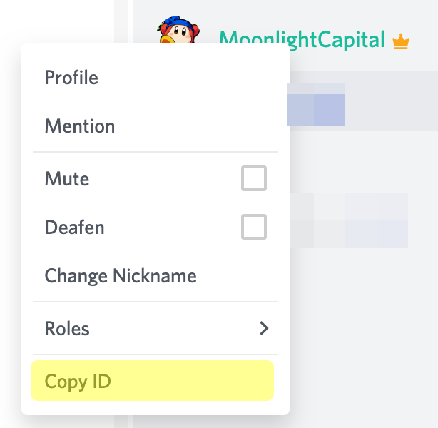

# Using developer mode

Discord has a developer mode feature that lets you copy IDs of nearly anything that has one, such as servers, users, channels, roles... etc. You can use developer mode to greatly skim through MoonlightBot's features.


You're not required to have bot developer skills to use developer mode. It does not also hinder your normal Discord usage in any way.


## Enabling developer mode

### On the Discord desktop app

1. Go to **User Settings** by clicking the gear icon in the bottom left of the window;
2. Go to "**Advanced**";
3. Click on the **Developer mode** toggle and you're done!















### On the Android app

1. Go to **User Settings** by clicking your avatar in the bottom right corner of the channel drawer;
2. Scroll down until the **Behavior** section;
3. Open **Behavior**;
4. Click on the **Developer mode** toggle and you're done!



















### On the iOS app

1. &#x20;Go to **User Settings** by clicking your avatar in the bottom right corner of the channel drawer;
2. &#x20;Scroll down until the **Appearance** section;
3. &#x20;Open **Appearance**;
4. &#x20;Click on the **Developer Mode** toggle and you're done!



















## Using developer mode

After you toggled developer mode nothing happened right? Well, try right clicking or going on an user's profile on mobile.

You can also do this for channels, roles, servers and messages. Whenever MoonlightBot asks for something like that, you can provide the ID as argument to make sure it's pointing to exactly what you want.
