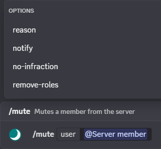
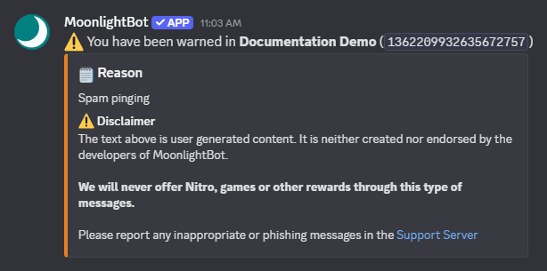
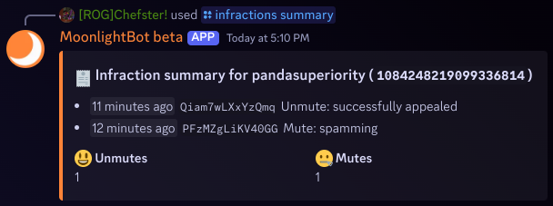
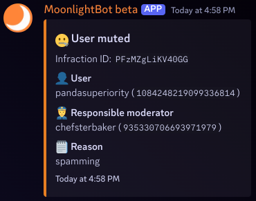

# Moderation Tutorial

This guide will give you the basic information needed to moderate your Discord server with MoonlightBot. It features a list of commands and how they work, complete with their options, infractions, and log information to help you better understand how to use them

## Command Options

These are options you may use while executing moderation commands. You can find a more in-depth guide about options in the [options page](options.md)

* `user`: The user to execute the moderation action on
* `reason`: The reason for which you are taking the action, useful for record keeping. The reason shows up in infractions, logs, and notifications from the bot
* `notify`: Whether or not the bot will message the user after the command is executed, as shown below 
* `no-infraction`: Whether or not the command will count towards the user's infractions


If both the `notify` and `no-infraction` options are true, the target will **not** be notified in order to prevent harassment via MoonlightBot


* `duration`: The amount of time for which the action taken will last. For information on the format used, refer to the [options page](options.md#Durations)
* `remove-roles`: Exclusive to the mute commands, this option will remove all of the user's roles except the muterole if true. This is to facilitate the effectiveness of the mute command


You can configure MoonlightBot to ban someone if they send a message while they have the mute role by running the command `/config settings mute-evasion-ban:True`. This is a helpful backup if the mute isn't working as intended


* `role`: The role to assign/remove in a role command

## Moderation Tools

These features help ensure a seamless moderation experience with MoonlightBot

### User IDs

A user ID is a string of numbers that is unique to a Discord account. Unlike usernames, the user ID cannot be changed, which is useful for various purposes, such as locating a user (even if they have changed their username to avoid detection) and executing commands for a user who has left the server. A great place to use IDs is the search bar, located at the top of the page.  To access user IDs, it is recommended that you enable [Developer Mode](../advanced/developer-mode.md), but MoonlightBot also displays user IDs next to usernames in command outputs

### Infractions

Infractions help staff members keep track of a user's bad conduct and make informed decisions while moderating. This is a versatile tool with multiple subcommands to assist your moderation needs

* [**`/infractions summary`**](../moderation-commands/infractions.md#summary): This command shows the 3 most recent infractions, and the infraction count of each different infraction type. If a tempban/mute/timeout is active, the command will show that as well
* [**`/infractions detailed`**](../moderation-commands/infractions.md#detailed): This command shows the infraction type, user affected, moderator who enforced it, reason, and date created
* [**`/infractions reason`**](../moderation-commands/infractions.md#reason): This command displays the reason given to the infraction, and allows you to edit it
* [**`/infractions search`**](../moderation-commands/infractions.md#search): This command allows you to see a list of infractions within given parameters, such as the moderator who executed them
* [**`/infractions delete`**](../moderation-commands/infractions.md#delete): This command deletes a specified infraction

### Logs

When moderators execute an action such as a warn, MoonlightBot will send a message in the designated logs channel in order to keep track of moderation events. For more information on setting up logs, refer to the logs section of the [main page](../#logging)

## Commands

All the commands listed can be found in the "Moderation Commands" and "Role Management Commands" categories

### Ban/Kick

* [**`/kick`**](../moderation-commands/kick.md): This command removes a user from the server, but they are able to rejoin if they have an invite
* [**`/ban`**](../moderation-commands/ban.md): This command kicks a user from the server and prohibits them from rejoining
* [**`/tempban`**](../moderation-commands/tempban.md): This command temporarily bans a user for a set amount of time
* [**`/softban`**](../moderation-commands/softban.md): This command bans a user then immediately unbans them. Though similar to the kick command, this command deletes the user's messages (useful for cleaning up spam)
* [**`/unban`**](../moderation-commands/unban.md): This command unbans a user from the server, allowing them to rejoin (if they have an invite)

### Mute


The mute commands requires a mute role. You can make one by using [`/create-muterole`](../management-commands/create-muterole.md); MoonlightBot will set everything up for you!


* [**`/mute`**](../moderation-commands/mute.md): This command suppresses a user from sending messages, creating threads, and adding reactions
* [**`/tempmute`**](../moderation-commands/tempmute.md): This command temporarily mutes a user for a set amount of time
* [**`/unmute`**](../moderation-commands/unmute.md): This command unmutes a user, allowing them to send messages again

### Role

* [**`/role`**](../role-management-commands/role.md): This command gives/takes a role from a user
* [**`/temprole`**](../role-management-commands/temprole.md): This command temporarily gives a role to a user for a set amount of time
* [**`/list-temproles`**](../role-management-commands/list-temproles.md): This command lists the active temproles
* [**`/pause-role`**](../role-management-commands/pause-role.md): This command takes a role from a user and gives it back after a set amount of time
