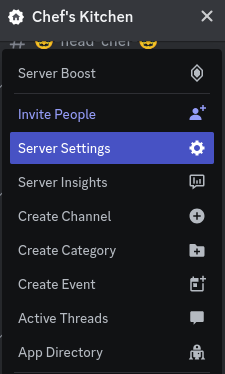
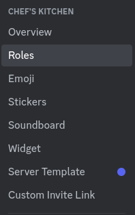
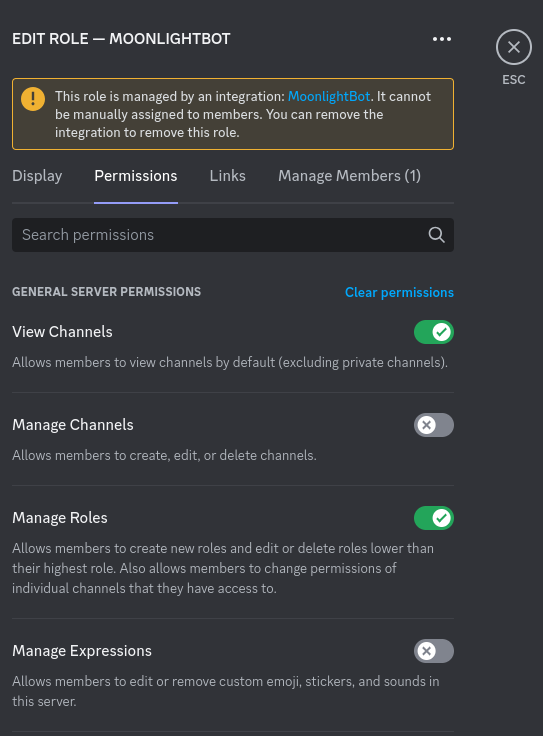

# Permissions

## Description

When utilizing the bot, it is important to give the bot certain permissions so it can complete the task successfully. This guide will help you recognize what each permissions does and why the bot needs it.

## Setup Guide

Click your server name and select `Server Settings`.

In the settings list, select `roles`.

In the roles list, select `MoonlightBot`.

Finally, select the `Permissions` tab.

Now you can start toggling permissions using the list below!

## Permissions List

### **Basic Permissions**

These permissions establish the basic functionality of the bot.

#### View Channel(s)

This permission allows the bot to perform actions such as distributing reaction roles and cleaning messages.

#### Send Messages

Although this permission is only required to clean messages, it is also helpful if you want feedback from the bot after performing an action.

### **Moderation**

These permissions allow the bot to assist your moderation.

#### Kick Members

This permissions is required if you want to kick a member via MoonlightBot.

#### Ban Members

This permission is required if you want to ban a member via MoonlightBot.

#### Timeout Members

This permission is required if you want to timeout a member via MoonlightBot.

### **Utility**

These permissions allow the bot to complete actions such as manage reaction roles, manage mute roles, and more.

#### Manage Channels

This permission is only used for creating muteroles.

#### Manage Roles

This permission allows the bot to distribute reaction roles, muteroles, temproles, and more.

#### Add Reactions

This permission is used solely for reaction roles.

#### Manage Messages

The bot uses this permission for reaction roles and cleaning messages.

#### Read Message History

This permission is only used for cleaning messages.