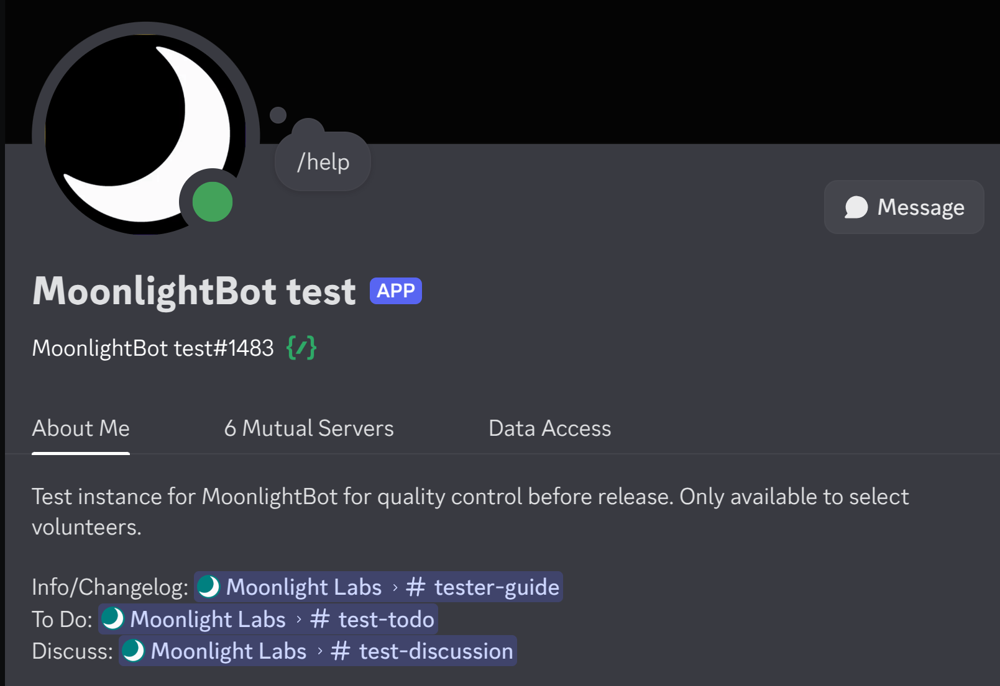
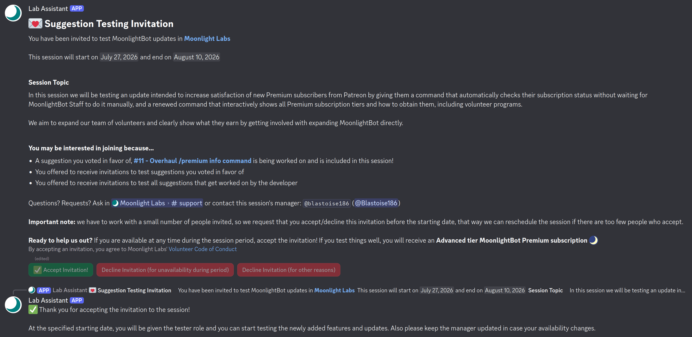
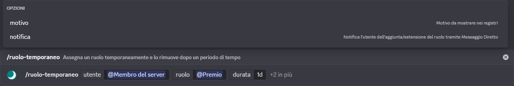

# Volunteer Opportunities

MoonlightBot is exclusively ran by volunteers - yes, even the developer - and we will be glad to accept you as part of our team! No coding skills required. In this page, you will find all the positions and roles we are looking to have on board.

Volunteering is a nice way to show your support for our charitable activities, connect with the community, and hone your server management skills. We offer generous benefits for all our volunteers akin to those of who support us financially, and [strong protections by policy from abusive users](../policies/acceptable-use-policy.md#id-3-respect-our-volunteers).

## Documentation Writer

Documentation writers are the volunteers who take care of this very documentation website, to provide the information that users need to use MoonlightBot. They describe the bot's features and commands in detail, more than possibly allowed by Discord's technical limitations.

Writers create new documentation pages as new commands are added to MoonlightBot, and update existing pages to reflect changes to allow MoonlightBot's sole developer to only focus on making code changes, which improves the productivity rate at which new features come out. This is an easy, yet extremely important volunteer position to be filled: time commitment is reasonable (can be even less than 2 hours a week), and you are given good automations and templates to get your pages started.

### Benefits for Documentation Writers

* A colorful, prominent **<mark style="color: rgb(104, 230, 160); background-color: rgba(104, 230, 160, 0.1);">Documentation Writers</mark>** role in the server to show everyone you're one of us
* The tester role (necessary to access their channels, the two roles work closely)
* [Super tier MoonlightBot Premium subscription](premium.md)
* Virtual gift cards of your choice (ex. Steam, Discord Nitro, Amazon) for important contributions
* Access to and testing of new features as they are developed
* Earliest possible access to upcoming updates
* Your name in the [Special Thanks Page](special-thanks.md#documentation-writers)

### Becoming a Documentation Writer

Anyone can fork and submit pull requests to the [Documentation GitHub Repository](https://github.com/MoonlightCapital/MoonlightBot-docs/), however, we are looking for a team of active maintainers who systematically expand, correct, and improve the documentation on guidance of the team, led by their caretaker.

There are a handful of ways to join the official writers team and received the benefits listed above:

1. **Submitting an Application:** We are always looking for new writers for our team. You can apply from the `#apply-for-doc-writer` in the support server, direct link: [**https://discord.gg/FFMkG9WhCv**](https://discord.gg/FFMkG9WhCv)
2. **Voluntary Contributions:** If you provide helpful advice or suggest edits - whether in the server or via pull requests - the documentation caretaker (who will always be a member of our Staff) will contact you directly to invite you as a writer

New writers are subject to a trial period, usually lasting two weeks, where they are asked to complete a task to determine their fitness for the program. If we're sufficiently satisfied with your performance, we will welcome you with full benefits.

The requirements to become a Documentation Writer are as follows:

* You must have a level of English comparable to B2 or higher in the [CEFR scale](https://rm.coe.int/CoERMPublicCommonSearchServices/DisplayDCTMContent?documentId=090000168045bb52)
* You must be at least 16 years old
* You must demonstrate an understanding of [Markdown text formatting](https://support.discord.com/hc/en-us/articles/210298617-Markdown-Text-101-Chat-Formatting-Bold-Italic-Underline). If you're used to writing informational channels and announcements in your Discord server, then you're all set!
* You must have been using MoonlightBot (based on date of first recorded interaction) for at least 1 month
* You must demonstrate strong attention to detail and proofreading skills
* You must not have any significant infraction history

## Tester

MoonlightBot Testers act as quality control in the development process. They carefully examine new updates with a special copy of the bot, functioning as a representative sample of end users. Testers also have a stronger voice when deciding which features are added to MoonlightBot next.

Tests do not impact your server as the MoonlightBot test instance is added in small private testing servers following the instructions provided by the program manager and your peers.

<figure><figcaption>
The MoonlightBot test instance
</figcaption></figure>

The tester program exists to uncover bugs and annoyances that might hinder a smooth user experience, before they even reach the [Beta release](beta.md). This collaborative team ensures that issues are reported and effectively addressed by the developer, making MoonlightBot not only functional but also enjoyable and user-friendly, based on aggregated experiences from owners/moderators of various servers!

We care a lot about releasing nearly-perfectly working updates, therefore we generously reward testers who find impactful bugs or propose changes that end up being appreciated with **virtual gift cards** you can choose from so we can fuel your passions!

As you make experience as a tester, you will be promoted to the higher tiers of **Specialist Tester** and then **Master Tester**, each of which provides more permissions and privileges that you can use to assist our team.

### Benefits for Testers

* A colorful, prominent **<mark style="color: #ef207a; background-color: rgba(239, 32, 122, 0.1);">MoonlightBot Testers</mark>** role in the server to show everyone you're one of us
* [Advanced Tier MoonlightBot Premium subscription](premium.md)
* Virtual gift cards of your choice for finding major bugs or suggesting useful changes (similar to those given to Documentation Writers)
* An opportunity to learn how to get the most from MoonlightBot and many other Discord apps
* The ability to request small changes and work closely with a developer with a direct line of communication
* Your votes on suggestions add to a higher score
* Your name in the [Special Thanks Page](special-thanks.md#testers)

### Becoming a Tester

Our tester program is structured in **sessions** that have a defined start and end date, and are focused on user-submitted suggestions that are connected to each session.

Start by joining the MoonlightBot support server: [**https://discord.gg/hNQWVVC**](https://discord.gg/hNQWVVC)

If you submit a suggestion, you will be asked whether you want to be invited to sessions and choose from a menu to test suggestions you submit, any suggestions if it's worked on, or to decide later. We recommend the **any suggestions** option because you can contribute to having others' suggestions tested to arrive at implementing yours first!

If you upvote a suggestion, the first time you will be asked if you want to be invited to sessions that include the suggestions you upvote. Have a look around the `#suggestions` forum channel and press the vote buttons depending on whether you like a suggestion or not!

Alternatively, the MoonlightBot Staff can invite you to a session if they assessed that you may benefit from certain features or improvements. This can happen with a higher chance if you report issues, bugs, have conversations in support channels, follow the rules or [vote for MoonlightBot](upvote-moonlightbot.md).

<figure><figcaption>
An invitation to a testing session, topic and reason why you may be interesting in join can vary.
</figcaption></figure>

Accepting the invitation will mark you available for the session, and on your first time, you will be given an introductory briefing, to then add the role to you and start on the set date. There is no penalty for declining an invitation through the provided buttons.

## Translator

MoonlightBot translators assist in translating the commands, responses and messages shown when interacting with the bot.

<figure><figcaption>
The <code>/temprole</code> command translated to Italian
</figcaption></figure>

### Benefits for Translators

* A colorful, prominent **<mark style="color: rgb(114, 141, 170); background-color: rgba(114, 141, 170, 0.1); background-color: rgba(104, 230, 160, 0.1);">MoonlightBot Translators</mark>** role in the server to show everyone you're one of us
* Appreciation from members of your server who find the text you translated
*   [Basic tier MoonlightBot Premium subscription](premium.md), once you have translated 50 strings

    Afterwards, your subscription will prolong for half a month provided you have translated at least 20 strings in the last half of the month, or **indefinitely** if there is no text left to translate
* Your name in the [Special Thanks Page](special-thanks.md#translators)

### Becoming a Translator

The requirements to become a Translator are as follows:

* You must be a native (or near-native) speaker of the language you're applying for
* You must have a level of English comparable to B1 or higher in the [CEFR scale](https://rm.coe.int/CoERMPublicCommonSearchServices/DisplayDCTMContent?documentId=090000168045bb52)
* You must be at least 16 years old
* You (or the server you represent) must have used MoonlightBot for more than two weeks
* You must not have any significant infraction history

If you meet the requirements above (some can be skipped in certain cases with Staff consent), you can then apply in the `#apply-for-translator` channel in the [Support Server](https://discord.gg/hNQWVVC). There you will find a button to press and fill out the application form.

Your application will be looked at, and if we're satisfied that you'd make a good candidate, we will create a private thread and ask you to complete a few short translation trials. If you pass the trial, we will give you full access to the translation program. This means you can get translating straight ahead! Usually this process takes less than 24 hours.
